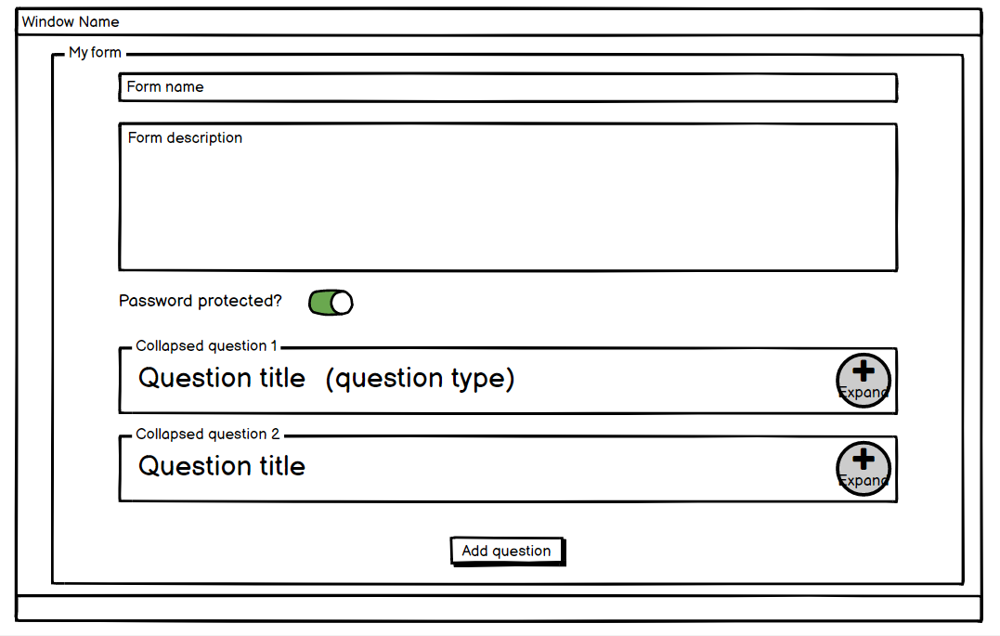
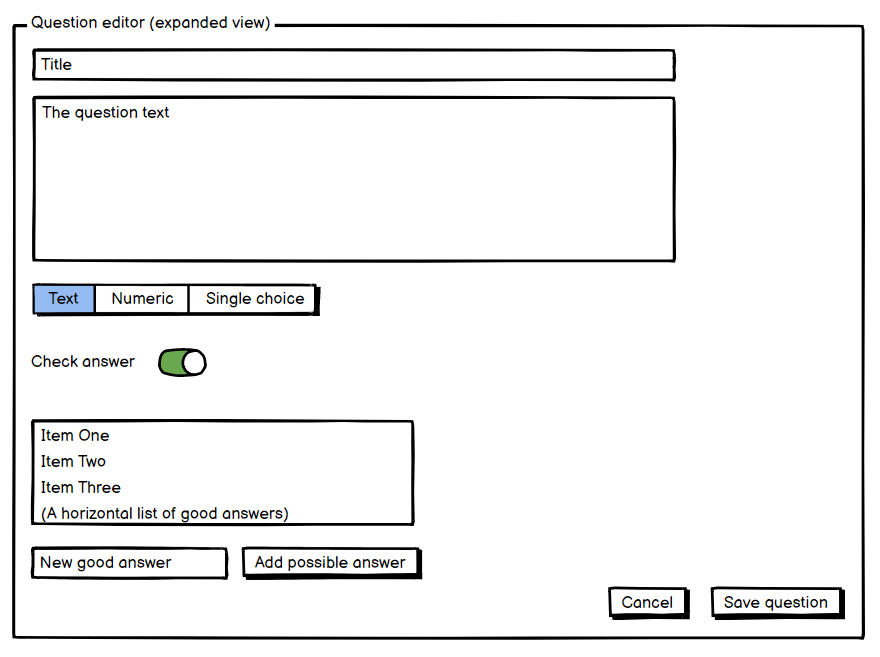
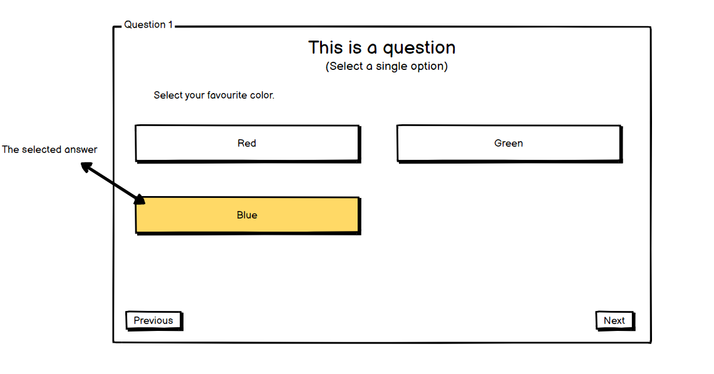
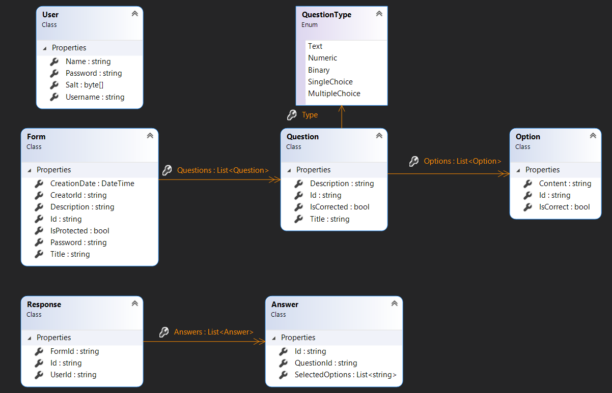

# BlazorFormDesigner

## Követelmények

### Funkcionális követelmények
Az alkalmazásban lehetőség van személyre szabott formok és online tesztek összeállítására, majd az azokra érkező válaszok adatbázisba való mentésére. Az alkalmazás az alábbi funkciókat támogatja:
* Form létrehozása, melyhez több kérdés is tartozhat
* Több féle kérdéstípus támogatása
    * Szöveges válasz
    * Numerikus válasz
    * Egyszeres választás előre megadott opciók közül
    * (Többszörös választás előre megadott opciók közül)
    * (Előre megadott opciók sorbarendezése)
* Egy kérdés létrehozásakor megadhatók helyes válaszok (és azokhoz tartozó pontértékek)
* Kérdések megjelölhetők kötelezően kitöltendőként, ilyenkor csak a kérdés megválaszolása után léphet tovább a felhasználó
* Az egyes formok jelszóval védhetők (, és opcionálisan határidő is megadható hozzájuk)
* Egy éles alkalmazásba természetesen kell felhasználó kezelés (pl. az általam készített formok listázásához), de nem tudom, hogy a kezdetben mennyire érdemes ebbe az irányba elmenni
* A kérdésekre adott válaszokat lehessen megtekinteni (opcionálisan diagram formájában vizualizálni)
* A válaszokat lehessen excel formátumban exportálni és letölteni

### Technológiai követelmények
Az alkalmazás alapvetően kliens-szerver architektúrából épül fel. A webes UI felületet a Blazor technológia segítségével építem fel (lehetőség szerint megismerkedek a szerver oldalon renderelt és a böngészőben futó WASM használati módokkal is). A szerver oldalon ASP.Net Core webApi-t használok a REST kérések kiszolgálására, és az üzleti logikát szintén .Net Core platformon valósítom meg. Az adatbázishoz egyelőre a MongoDB-t részesíteném előnyben, egyfelől, hogy alaposabban is megismerkedjek ezzel a technológiával, másfelől alkalmasnak találom a félig strukturált adatok tárolásához. (pl.: egy formhoz tartozó több kérdés, melyek típusai - és a rá adható válaszok - akár különbözők is lehetnek)

## UI wireframe tervek
Új form létrehozásakor megadhatjuk annak alapadatait, és kérdéseket adhatunk hozzá. Az eddig hozzáadott kérdések címsora is látszódik, és ha szerkeszteni szeretnénk őket, akkor lenyithatók.

Kérhés létrehozása vagy szerkesztése közben kiválaszthatjuk a kérdés típusát (ennek függvényében kellhet megadnunk választható opciókat) és beállíthatjuk, hogy a válasz értékelve legyen-e) ekkor helyes válaszokat is meg kell adnunk.

Az ábrán egy egyszeres választós kérdésre adott válasz látszik, ha beállítottok, akkor a rendszer a "Next" gombra való kattintás után ellenőrzi a választ, aminek az eredménye a következő két képen látszik. (Lehet, hogy inkább a végén egyben kellene ellenőrizni, hogy a kijelölt válaszokat még lehessen később módosítani.)

## Architekturális tervek
Az alkalmazásban szereplő entitások osztálydiagrammja

